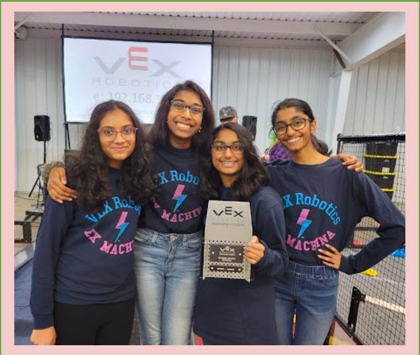
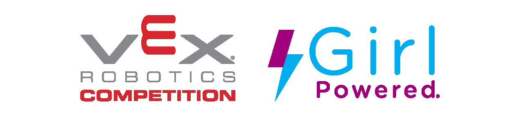
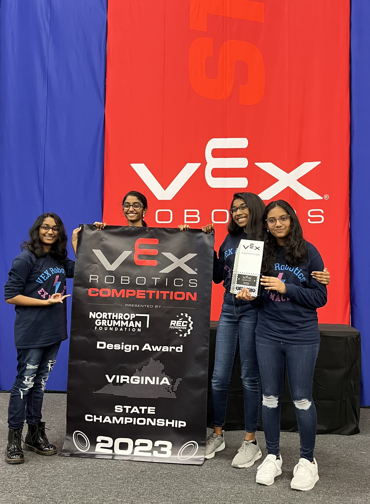
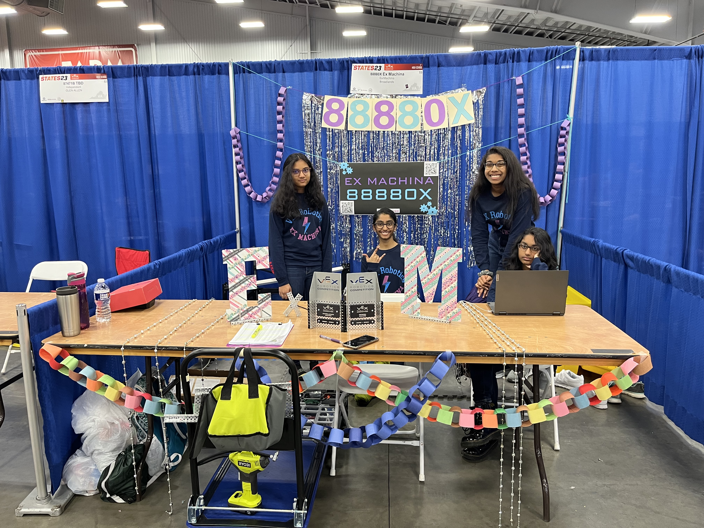

_Left to Right: Aneesha Koninty, Rayna Budigelli, Niesha Karthik, Amulya Gottipati_

# VRC Spin Up Season 2022-2023

We are excited to announce that we have won the **Design Award** at the **2023 Virginia High School VRC State Championship** and getting ready for [VEX Robotics World Championship](https://roboticseducation.org/vex_worlds/).

Our engineering notebook showcases our engineering design process of strategizing and brainstorming, designing and building, coding and testing, and then competing with the robot. This has led us to winning the **Excellence Award** and  **Design Award** during the current season at regional tournaments in northern Virgina.

## About Our Robot!

Our Spin Up bot "RoBob" has gone through many revisions and the current iteration has:
* 4 motor drivetrain - with 200 RPM motor cartiridge geared up to 280 RPM on 4-inch wheels
* 2 motor intake/spinner - with 600 RPM motor cartiridge, typically running at 400 RPM
* 2 motor flywheel - with 600 RPM motor cartiridge, geared up to 3000 RPM, but typically running at 1800-2100 RPM
* 15s win-point capable auton - spins roller and shoots 2 (left) or 5 (right) disks
* 150+ point capable programming skills
* Inertial sensor for accurate turn PID and shooting orientation
* Distance sensors for Okapilib Odometery error correction and reset
* Optical Sensor to detect proximity and color of rollers for spinner automtion
* Optical line trackers for tracking disk intake/outake for 3-disk intake automation
* 3-encoder odomoetry using our own extensions to Okapilib, that averages left and right integrated motor group encoders and an external middle encoder

# About Us!
We are Team **88880X**, otherwise known as Ex Machina.

We are all sophomores at Rock Ridge High School in Ashburn, Virginia. This is our fourth year of competing in the Vex Robotics Competition (VRC). We are all studious, ambitious individuals who are willing to work diligently for VRC, whether working asynchronously at home on code, or sacrificing entire weekends to improve and tune our robot. Not only do we strive to be among the top 10 teams in our state, we also know that VRC is a great opportunity to learn all types of engineering and programming concepts while we’re at it!
 
On our team, everyone pitches in, and we all have different tasks and roles that help our team function as a whole.
 
The team members have the following roles:
* Amulya: Strategist / Builder / Designer
* Aneesha: Builder / Designer / Scout
* Niesha: Programmer / Driver / Designer
* Rayna: Manager / Programmer / Scout

## Past Accomplishments

As middle schoolers, couple of us (Amulya and Niesha) competed as Stone Hill Middle School team 6096F and 6096A. During that time we won numerous awards at northern Virginia regional tournaments and were **Tournament Champions** at the **2020 Virginia Middle School VRC State Championship** and in the following COVID year, we won the **Excellence Award** at the [2021 Live Remote VEX Robotics World Championship](https://roboticseducation.org/2021-live-remote-vex-robotics-world-championship-winners/).

